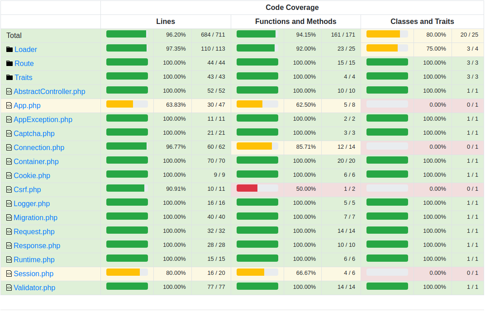

DW-Framework – минималистичный и производительный MVC-фреймворк

Он был написан для следующих целей:

- «Хочешь разобраться как что-то работает – напиши свой аналог с нуля». Мне было интересно как работают MVC-фреймворки,
и чтобы разобраться в этом я написал свой 😈
- Получить фреймворк с максимальной производительностью – по этой причине не используются интерфейсы, не используются 
стандартные [PSR Request/Response](https://www.php-fig.org/psr/psr-7/), переменные окружения (конфиг сделан через 
константы) и прочее.
- В качестве отдыха от навороченной и тяжелой связки Symfony+Doctrine с которой работаю на обычной работе уже последние
5 лет.

Если вам интересно посмотреть пример качественного ООП — загляните в [Battle Module](https://github.com/WalkWeb/Battle-Module).
В противоположность этому проекту, там я заморочился с качественным ООП, но производительность, разумеется, страдает 
(чем больше ООП-наворотов и абстракций — тем хуже производительность).

# Установка

`cd /var/www/`

`git clone https://github.com/WalkWeb/DW-Framework.git dw-framework.loc`

`cd dw-framework.loc`

`composer install`

Копируем `config.php` переименовываем в `config.local.php` и указываем нужные параметры

Далее необходимо настроить локальный домен (nginx/apache/встроенный веб-сервер в php — на ваш выбор)

# Запуск тестов

Часть тестов требуют MySQL базу. Достаточно только наличие базы — нужные таблицы и данные будут созданы автоматически.

Копируем `config.php` переименовываем в `config.test.php` и указываем параметры доступа к тестовой базе.

Запуск тестов:

`php vendor/bin/phpunit`

# Покрытие тестами

# Планы

- Добавить middleware
- Добавить пример регистрации/авторизации
- Консольные команды
- Перевод README.md и всех комментариев в коде на английский
- Добавить phpstan
- Добавить проверку code style

| Класс       | Контейнер | Статика | Примечание                          |  
|-------------|:---------:|:-------:|-------------------------------------|
| Captcha     |     +     |         |                                     |
| Connection  |     +     |         |                                     |
| Cookie      |     +     |         |                                     |
| Csrf        |     +     |         |                                     |
| Logger      |     +     |         |                                     |
| Migration   |           |         |                                     |
| Runtime     |     +     |         |                                     |
| Session     |           |    +    | Убрать статику                      |
| Validator   |     +     |         |                                     |
| Request     |     +     |         |                                     |

## P.S.

[Первая версия самописного микрофреймворка](https://github.com/WalkWeb/TickTackToe), просто чтобы ужаснуться :)
